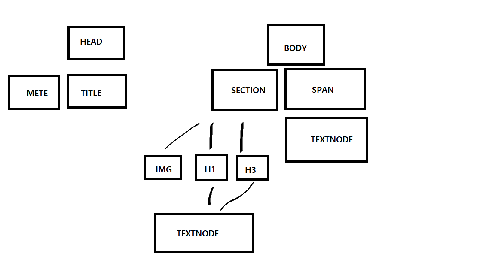

# 220310 Study

- DOM TREE 란?
- DOM은 (document object model) 문서 객체 모델

```html
<!DOCTYPE html>
<head>
  <title>상준홈</title>
</head>
<body>
  <section>
    
    <h1>안녕하세요</h1>
    <h3>유상준입니다</h3>
  </section>
  <span>웹 스터티 화이팅 !</span>
</body>
```

위 예제 처럼 사용자가 간단한 웹페이지를 만들면
브라우저는 html파일을 읽게 된다  
브라우저는 파일들을 읽으면서
각 태그들을 분석해서 노드로 반환하게 된다  
html은 객체의 트리식 구조화로 되어있어 이과정을 DOM 트리를 생성한다 라고 말한다  


그림예제를 보면 어떤 태그를 쓰느냐에 따라서
htmlsectionelement,htmlh3element 식으로  
각각의 타입별로 요소들이 존재하게 된다

그래서 풀이하게되면 htmlsectionelement는 html에 element이고  
htmlelement는 element이고 element는 node이고 node는  
 eventTarget 객체를
상속함으로 모든 node는
이벤트가 발생할수 있다라고 말할수 있다
